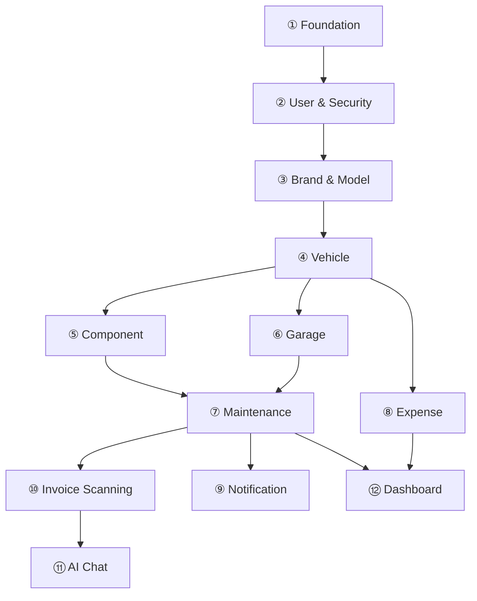

# AutoCare AI — Restored Architecture Blueprint

This document represents the consolidated restoration of the Spring Boot backend and React Native mobile architecture designs, reconstructed from the chat log export. Since the previous design documents were stored locally on your old PC, this file acts as your new master design reference.

---

## 🏗️ 1. Backend Architecture (Spring Boot 3 + Java 21)

The backend is designed as a **Modular Monolith** using vertical slicing. This enforces strict boundary controls while keeping deployment simple (single jar / Docker container).

### Package Structure and Folder Organization
The package structure is organized under `com.autocare`. Each domain module follows a clean separation of layers:
*   **Presentation Layer**: `controller/` (REST endpoints, route-specific validations, role checks)
*   **Business Logic Layer**: `service/` (Core services, business rules, transactional boundaries, validation orchestrations)
*   **Persistence Layer**: `repository/` (Spring Data JPA interfaces), `entity/` (JPA database entities)
*   **Mapping & DTOs**: `dto/` (request/response payloads), `mapper/` (data conversion logic)

#### Vertical Slice Modules
The package directory structure created on disk contains the following modules:
1.  **`shared` (Shared Kernel)**: Core configurations, utilities, validation rules, global exceptions, and standard envelope DTOs (`ApiResponse`, `PageResponse`, `ErrorResponse`).
2.  **`security`**: Security configurations, custom filters, JWT handling, refresh token persistence, and role hierarchies.
3.  **`infrastructure`**: Adapters for third-party services: Cloudinary (media upload), Gemini API (AI assistant), and OCR (invoice text extraction).
4.  **`auth`**: Authentication endpoints (no entities; handles user login, register, token refresh).
5.  **`user`**: User profiles, roles, settings.
6.  **`vehicle`**: Core vehicle entity (garage association, model link, media).
7.  **`brand`**: Brand metadata catalog (Toyota, BMW, etc.).
8.  **`model`**: Model metadata catalog linked to brands.
9.  **`component`**: Vehicle parts management (brakes, filters, battery, etc.).
10. **`maintenance`**: Servicing and repair logs.
11. **`invoice`**: Scanned invoice tracking.
12. **`expense`**: Comprehensive financial tracking (fuel, repairs, insurance, etc.).
13. **`notification`**: In-app notifications and scheduled maintenance alerts.
14. **`conversation`**: Persistent chat histories with the AI assistant.
15. **`garage`**: Service garages, locations, and mechanic details.
16. **`dashboard`**: Aggregated metrics and charts (read-only queries).

---

## 🚦 2. 12-Step Implementation Roadmap

The backend modules must be implemented sequentially based on their dependency graphs.

| Step | Module | Complexity | Description / Why This Order |
| :--- | :--- | :---: | :--- |
| **①** | **Foundation** | 🟢 | Establishes the project base, global configurations, shared DTOs, and global exception handlers. Every module depends on this. |
| **②** | **User & Security** | 🔴 | Establishes authentication (JWT + Refresh rotation) and API security layers. Required early because all subsequent endpoints are secured. |
| **③** | **Brand & Model** | 🟢 | Holds vehicle brand and model catalogs. Standardizes the CRUD repository-to-DTO pattern. |
| **④** | **Vehicle** | 🟡 | The core domain entity. Introduces media uploads via Cloudinary. |
| **⑤** | **Component** | 🟡 | Tracks car parts (maintenance runs depend directly on component parts). |
| **⑥** | **Garage** | 🟢 | Standard directories for mechanics. Simple CRUD that is off the critical dependency path. |
| **⑦** | **Maintenance** | 🟡 | Manages service logs. This is the first module that involves complex cross-module writes. |
| **⑧** | **Expense** | 🟡 | Triggers financial metrics. Connected to invoice scans which auto-create expenses. |
| **⑨** | **Notification** | 🟡 | Reactive alerts triggered by service logs and odometer milestones. |
| **⑩** | **Invoice Scanning** | 🔴 | Core OCR flow. Heaviest orchestrator that links invoices to vehicles, maintenance runs, and expenses. |
| **⑪** | **AI Chat** | 🔴 | Integrates Gemini API for diagnostics and user chat based on domain context. |
| **⑫** | **Dashboard** | 🟡 | Aggregate reporting, telemetry charts, and vehicle valuation estimations. |

---

## 🗄️ 3. Flyway Schema Migration Sequence

Flyway version migrations will create tables in a strict order corresponding to database constraints and foreign keys.

| Migration File | Target Table | Foreign Keys & Dependencies |
| :--- | :--- | :--- |
| `V1__create_users_table.sql` | `users` | Base table |
| `V2__create_refresh_tokens_table.sql` | `refresh_tokens` | `user_id` $\rightarrow$ `users` |
| `V3__create_password_reset_tokens_table.sql` | `password_reset_tokens` | `user_id` $\rightarrow$ `users` |
| `V4__create_brands_table.sql` | `brands` | Base table |
| `V5__create_models_table.sql` | `models` | `brand_id` $\rightarrow$ `brands` |
| `V6__create_vehicles_table.sql` | `vehicles` | `user_id` $\rightarrow$ `users`, `model_id` $\rightarrow$ `models` |
| `V7__create_component_types_table.sql` | `component_types` | Catalog table |
| `V8__create_vehicle_components_table.sql` | `vehicle_components` | `vehicle_id` $\rightarrow$ `vehicles`, `component_type_id` $\rightarrow$ `component_types` |
| `V9__create_garages_table.sql` | `garages` | Base table |
| `V10__create_invoices_table.sql` | `invoices` | `vehicle_id` $\rightarrow$ `vehicles` |
| `V11__create_maintenances_table.sql` | `maintenances` | `component_id` $\rightarrow$ `vehicle_components`, `invoice_id` $\rightarrow$ `invoices`, `garage_id` $\rightarrow$ `garages` |
| `V12__create_expense_categories_table.sql` | `expense_categories` | Catalog table |
| `V13__create_expenses_table.sql` | `expenses` | `vehicle_id` $\rightarrow$ `vehicles`, `category_id` $\rightarrow$ `expense_categories` |
| `V14__create_notifications_table.sql` | `notifications` | `vehicle_id` $\rightarrow$ `vehicles` |
| `V15__create_conversations_table.sql` | `conversations` | `user_id` $\rightarrow$ `users` |
| `V16__create_messages_table.sql` | `messages` | `conversation_id` $\rightarrow$ `conversations` |
| `R__seed_expense_categories.sql` | *Seed Data* | Inserts 10 default expense categories |
| `R__seed_component_types.sql` | *Seed Data* | Inserts 21 standard component parts |

---

## 🔒 4. Authentication & Security Flow

*   **JWT Access Tokens**: Stateless, HS512 signed, contains minimal claims (`sub`, `role`, `iat`, `exp`), short lifetime (15 minutes).
*   **Refresh Tokens**: Stored securely in database, 7-day lifetime, **family-based token rotation with replay detection**. If a compromised refresh token is reused, the entire session family is instantly invalidated.
*   **Authorization Matrix**: 
    1.  *Authentication Filter* (validates JWT, throws 401).
    2.  *Spring Security Configuration* (checks URL pattern against roles: `USER`, `ADMIN`, throws 403).
    3.  *Service-level Ownership Check* (ensures resources belong to the authenticated user, throws 403).
*   **Password Reset**: Plain link token emailed $\rightarrow$ SHA-256 hash stored in DB $\rightarrow$ 30-min expiry $\rightarrow$ single-use. Resetting passwords immediately invalidates all active sessions (deletes refresh token family).

---

## 📱 5. Mobile Architecture (React Native + Expo)

The mobile app follows a feature-aligned layout matching the backend 1:1.

*   **State Management**: TanStack Query (server state cache), Zustand (global sync/UI/auth state), React Hook Form + Zod (client validation).
*   **API Client**: Axios instance with mutex-based interceptors. All concurrent failed requests (due to expired JWT) are queued; a single token refresh request is dispatched, and upon completion, the queue is re-executed transparently.
*   **Offline strategy**:
    *   *Reference data* (Brands, Component Types, Expense Categories) cached indefinitely (refreshed only in background).
    *   *Domain data* cached for 30 minutes with a "stale data" banner indicator when offline.
    *   *Write operations* and *AI Chat* features are disabled when no connection is present.

---

## ⚙️ 6. Open Architecture Decisions

To start writing code, we need to finalize three questions that were left open:

1.  **Build Tool Selection**: Do you prefer **Maven** (`pom.xml`) or **Gradle** (`build.gradle` / Kotlin DSL)?
2.  **OCR Scanner Placement**: How should we scan invoices?
    *   *Option A*: Direct device-side text extraction (using Google ML Kit on mobile) and passing parsed text to the backend.
    *   *Option B*: Uploading raw images (to Cloudinary) and running OCR entirely on the backend using Gemini's multimodal capabilities. (Recommended for high accuracy).
3.  **Entity-DTO Mapping**:
    *   *Option A*: **MapStruct** (generates type-safe mapping code at compile-time, very fast and clean).
    *   *Option B*: **ModelMapper** (runtime mapping, easy to set up but uses reflection and harder to debug).
    *   *Option C*: Manual mappings inside mapping utility classes (maximum control, zero dependencies, but more boilerplate).
