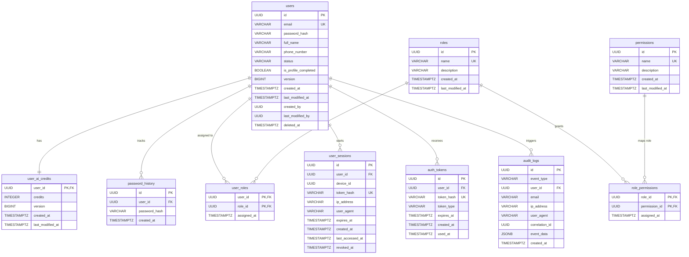

# AutoCare AI — Authentication Module Database Design Specification

This document defines the complete logical and physical database schema for the AutoCare AI Authentication module, conforming to the `DEVELOPMENT_RULES.md` and `API_STANDARDS.md` requirements. 

---

## 1. Database Design Principles

*   **UUIDv4 Identity Strategy**: All table primary keys use PostgreSQL `UUID` types. This prevents ID enumeration attacks, supports distributed primary key generation, and matches the API contract definitions.
*   **Cryptographic Secret Hashing**: Sensitive tokens (Refresh Tokens, Verification Tokens, Reset Tokens, and historical passwords) are never stored in plaintext. The database only stores their **SHA-256** hexadecimal hash (`VARCHAR(64)`) or **BCrypt** hash (`VARCHAR(60)`).
*   **Optimistic Locking**: Critical tables subject to concurrent modifications (`users` and `user_ai_credits`) feature a `version` (`BIGINT`) column to prevent lost updates without heavy pessimistic locking.
*   **Index Referential Paths**: All foreign key columns are explicitly indexed to avoid full table scans during joins, updates, or deletes.
*   **Time Zone Integrity**: All timestamp columns are mapped using PostgreSQL `TIMESTAMP WITH TIME ZONE` (`timestamptz`) to ensure timezone normalization.
*   **Auditability**: Core domain tables contain audit columns for tracking modifications. Security event auditing uses an append-only, high-performance structured table (`audit_logs`) with a JSONB metadata payload.

---

## 2. Enums (Type Constants)

To enforce clean data state ranges at the database layer, the following types are defined:

*   **`account_status`**: `UNVERIFIED`, `ACTIVE`, `SUSPENDED`
*   **`auth_token_type`**: `EMAIL_VERIFICATION`, `PASSWORD_RESET`
*   **`audit_event_type`**: `USER_REGISTERED`, `EMAIL_VERIFIED`, `LOGIN_SUCCESS`, `LOGIN_FAILURE`, `PASSWORD_RESET_REQUESTED`, `PASSWORD_RESET_COMPLETED`, `SESSION_REVOKED`

---

## 3. Detailed Table Specifications

### A. `users` Table
*   **Why It Exists**: Represents the central user identity entity. Stores authentication credentials and account state metadata.
*   **Columns**:
    *   `id` (`UUID`, Primary Key, Default: `gen_random_uuid()`)
    *   `email` (`VARCHAR(255)`, Unique, Not Null) — Standardized lowercased RFC 5322 email string.
    *   `password_hash` (`VARCHAR(60)`, Not Null) — Blowfish Crypt (BCrypt) hashed password.
    *   `full_name` (`VARCHAR(100)`, Not Null)
    *   `phone_number` (`VARCHAR(20)`, Nullable)
    *   `status` (`VARCHAR(50)` / Enum `account_status`, Not Null, Default: `UNVERIFIED`)
    *   `is_profile_completed` (`BOOLEAN`, Not Null, Default: `false`)
    *   `version` (`BIGINT`, Not Null, Default: `0`) — Optimistic locking token.
    *   `created_at` (`TIMESTAMPTZ`, Not Null, Default: `CURRENT_TIMESTAMP`)
    *   `last_modified_at` (`TIMESTAMPTZ`, Not Null, Default: `CURRENT_TIMESTAMP`)
    *   `created_by` (`UUID`, Nullable)
    *   `last_modified_by` (`UUID`, Nullable)
    *   `deleted_at` (`TIMESTAMPTZ`, Nullable) — Soft delete timestamp.
*   **Relationships**:
    *   Many-to-Many with `roles` via `user_roles`
    *   One-to-One with `user_ai_credits`
    *   One-to-Many with `user_sessions`
    *   One-to-Many with `auth_tokens`
    *   One-to-Many with `password_history`
    *   One-to-Many with `audit_logs`
*   **Index Strategy**:
    *   `idx_users_email` (Unique): For fast lookup during logins and email availability checks.
    *   `idx_users_status_deleted`: Composite index on `(status, deleted_at)` to support active user queries.
*   **Security Considerations**:
    *   `password_hash` length is limited strictly to 60 characters to fit BCrypt output.
    *   Emails must be saved lowercased to prevent duplicate logins using mixed-case addresses.
    *   Soft deletion using `deleted_at` ensures references in transaction history (e.g. maintenance records) remain structurally intact.

### B. `user_ai_credits` Table
*   **Why It Exists**: Moves numeric usage credits into a dedicated table to isolate high-frequency credit mutations from user profile changes and keep transactions lightweight.
*   **Columns**:
    *   `user_id` (`UUID`, Primary Key, Foreign Key pointing to `users.id`)
    *   `credits` (`INTEGER`, Not Null, Default: `0`) — Numeric credit quota for AI interactions.
    *   `version` (`BIGINT`, Not Null, Default: `0`) — Optimistic locking version for concurrent AI consumption.
    *   `created_at` (`TIMESTAMPTZ`, Not Null, Default: `CURRENT_TIMESTAMP`)
    *   `last_modified_at` (`TIMESTAMPTZ`, Not Null, Default: `CURRENT_TIMESTAMP`)
*   **Cascade Rules**:
    *   `ON DELETE CASCADE` when the parent user is hard deleted.
*   **Index Strategy**:
    *   Primary key is `user_id`, which naturally builds a unique index.
*   **Security Considerations**:
    *   Separating credits protects financial/usage logic from profile updates. Optimistic locking prevents race conditions when consumers click concurrently.

### C. `password_history` Table
*   **Why It Exists**: Holds historical BCrypt-hashed passwords for each user, allowing the system to enforce rules preventing reuse of past passwords.
*   **Columns**:
    *   `id` (`UUID`, Primary Key, Default: `gen_random_uuid()`)
    *   `user_id` (`UUID`, Foreign Key pointing to `users.id`, Not Null)
    *   `password_hash` (`VARCHAR(60)`, Not Null) — BCrypt password hash.
    *   `created_at` (`TIMESTAMPTZ`, Not Null, Default: `CURRENT_TIMESTAMP`)
*   **Cascade Rules**:
    *   `ON DELETE CASCADE` when the parent user is hard deleted.
*   **Index Strategy**:
    *   `idx_pass_history_user_id`: Index on `(user_id)` to quickly pull recent password hashes.
*   **Security Considerations**:
    *   Only store secure BCrypt hashes. Plain passwords must never enter the database.

### D. `roles` Table
*   **Why It Exists**: Defines security groups/roles inside the application (e.g., `ROLE_USER`, `ROLE_ADMIN`).
*   **Columns**:
    *   `id` (`UUID`, Primary Key, Default: `gen_random_uuid()`)
    *   `name` (`VARCHAR(50)`, Unique, Not Null) — Security group tag.
    *   `description` (`VARCHAR(255)`, Nullable)
    *   `created_at` (`TIMESTAMPTZ`, Not Null, Default: `CURRENT_TIMESTAMP`)
    *   `last_modified_at` (`TIMESTAMPTZ`, Not Null, Default: `CURRENT_TIMESTAMP`)
*   **Relationships**:
    *   Many-to-Many with `users` via `user_roles`
    *   Many-to-Many with `permissions` via `role_permissions`
*   **Index Strategy**:
    *   `idx_roles_name` (Unique): For role evaluation lookup.
*   **Security Considerations**:
    *   Roles cannot be created, updated, or deleted by standard application actions (read-only in normal runtime).

### E. `user_roles` Table (Join Table)
*   **Why It Exists**: Resolves the Many-to-Many relationship between `users` and `roles`.
*   **Columns**:
    *   `user_id` (`UUID`, Foreign Key pointing to `users.id`, Not Null)
    *   `role_id` (`UUID`, Foreign Key pointing to `roles.id`, Not Null)
    *   `assigned_at` (`TIMESTAMPTZ`, Not Null, Default: `CURRENT_TIMESTAMP`)
*   **Primary Key Constraint**: Composite primary key on `(user_id, role_id)`.
*   **Cascade Rules**:
    *   `ON DELETE CASCADE` for both `user_id` and `role_id` to cleanup link associations.
*   **Index Strategy**:
    *   `idx_user_roles_role_id`: Prevents table scans when queries filter by role assignments.

### F. `permissions` Table
*   **Why It Exists**: Fine-grained access control privilege tags mapped to domains (e.g. `vehicles:read`, `vehicles:write`).
*   **Columns**:
    *   `id` (`UUID`, Primary Key, Default: `gen_random_uuid()`)
    *   `name` (`VARCHAR(100)`, Unique, Not Null)
    *   `description` (`VARCHAR(255)`, Nullable)
    *   `created_at` (`TIMESTAMPTZ`, Not Null, Default: `CURRENT_TIMESTAMP`)
    *   `last_modified_at` (`TIMESTAMPTZ`, Not Null, Default: `CURRENT_TIMESTAMP`)
*   **Relationships**:
    *   Many-to-Many with `roles` via `role_permissions`
*   **Index Strategy**:
    *   `idx_permissions_name` (Unique): Fast resolution during security filter evaluation.

### G. `role_permissions` Table (Join Table)
*   **Why It Exists**: Resolves the Many-to-Many relationship between `roles` and `permissions` to support dynamic RBAC.
*   **Columns**:
    *   `role_id` (`UUID`, Foreign Key pointing to `roles.id`, Not Null)
    *   `permission_id` (`UUID`, Foreign Key pointing to `permissions.id`, Not Null)
    *   `assigned_at` (`TIMESTAMPTZ`, Not Null, Default: `CURRENT_TIMESTAMP`)
*   **Primary Key Constraint**: Composite primary key on `(role_id, permission_id)`.
*   **Cascade Rules**:
    *   `ON DELETE CASCADE` for both foreign keys to handle role/permission pruning cleanly.
*   **Index Strategy**:
    *   `idx_role_permissions_permission_id`: Faster reverse checks for permission ownership.

### H. `user_sessions` Table
*   **Why It Exists**: Tracks active logged-in devices and sessions. Supports Refresh Token Rotation (RTR) and multi-device logout capabilities.
*   **Columns**:
    *   `id` (`UUID`, Primary Key, Default: `gen_random_uuid()`) — Mapped as the `sessionId` claim in the Access Token.
    *   `user_id` (`UUID`, Foreign Key pointing to `users.id`, Not Null)
    *   `device_id` (`UUID`, Not Null) — Persistent client-side installation identifier.
    *   `token_hash` (`VARCHAR(64)`, Unique, Not Null) — SHA-256 hash of the generated refresh token string.
    *   `ip_address` (`VARCHAR(45)`, Not Null) — Stores IPv4 or IPv6 source address.
    *   `user_agent` (`VARCHAR(512)`, Not Null)
    *   `expires_at` (`TIMESTAMPTZ`, Not Null) — Matches the configured lifespan (7 or 30 days).
    *   `created_at` (`TIMESTAMPTZ`, Not Null, Default: `CURRENT_TIMESTAMP`)
    *   `last_accessed_at` (`TIMESTAMPTZ`, Not Null, Default: `CURRENT_TIMESTAMP`)
    *   `revoked_at` (`TIMESTAMPTZ`, Nullable) — Tracks when a session was closed or rotated out.
*   **Cascade Rules**:
    *   `ON DELETE CASCADE` if the parent user account is fully purged (hard deleted).
*   **Index Strategy**:
    *   `idx_user_sessions_token_hash` (Unique): Fast resolution during silent refreshes.
    *   `idx_user_sessions_user_id`: Fast query when retrieving a user's active devices list (`GET /api/v1/auth/sessions`).
    *   `idx_user_sessions_expiry_revoked`: Composite index on `(expires_at, revoked_at)` to accelerate background session-cleanup routines.
*   **Security Considerations**:
    *   Hashing the token prevents database intruders from hijacking active sessions.
    *   Logging out or rotating a token soft-revokes the session by updating `revoked_at`, keeping audit records intact.

### I. `auth_tokens` Table
*   **Why It Exists**: Holds short-lived verification tokens for email confirmation and password reset workflows.
*   **Columns**:
    *   `id` (`UUID`, Primary Key, Default: `gen_random_uuid()`)
    *   `user_id` (`UUID`, Foreign Key pointing to `users.id`, Not Null)
    *   `token_hash` (`VARCHAR(64)`, Unique, Not Null) — SHA-256 hash of the verification/reset URL token.
    *   `token_type` (`VARCHAR(50)`, Not Null) — Enum matching `auth_token_type`.
    *   `expires_at` (`TIMESTAMPTZ`, Not Null)
    *   `created_at` (`TIMESTAMPTZ`, Not Null, Default: `CURRENT_TIMESTAMP`)
    *   `used_at` (`TIMESTAMPTZ`, Nullable)
*   **Cascade Rules**:
    *   `ON DELETE CASCADE` on `user_id`.
*   **Index Strategy**:
    *   `idx_auth_tokens_hash` (Unique): Quick resolution when users submit links.
    *   `idx_auth_tokens_expiry_type`: Composite `(expires_at, token_type)` for garbage collection.
*   **Security Considerations**:
    *   Tokens must be marked as `used_at` immediately upon consumption to prevent replay attacks.

### J. `audit_logs` Table
*   **Why It Exists**: An append-only repository of security and lifecycle actions.
*   **Columns**:
    *   `id` (`UUID`, Primary Key, Default: `gen_random_uuid()`)
    *   `event_type` (`VARCHAR(100)`, Not Null) — Type tag matching `audit_event_type`.
    *   `user_id` (`UUID`, Nullable, Foreign Key pointing to `users.id`) — Null for unresolvable accounts (e.g. invalid username).
    *   `email` (`VARCHAR(255)`, Nullable) — Used when logging login failures where the ID cannot be found.
    *   `ip_address` (`VARCHAR(45)`, Not Null)
    *   `user_agent` (`VARCHAR(512)`, Not Null)
    *   `correlation_id` (`UUID`, Not Null) — Corresponds to the API response `X-Correlation-Id` header.
    *   `event_data` (`JSONB`, Nullable) — Structured contextual details (e.g., failed reasons, registration devices).
    *   `created_at` (`TIMESTAMPTZ`, Not Null, Default: `CURRENT_TIMESTAMP`)
*   **Cascade Rules**:
    *   `ON DELETE RESTRICT` (or no cascade) on `user_id` to prevent deleting audit logs if a user gets hard deleted. Keep logs orphaned for security audits.
*   **Index Strategy**:
    *   `idx_audit_correlation_id`: Fast trace retrieval when troubleshooting errors via a client correlation ID.
    *   `idx_audit_user_id_created`: Composite index `(user_id, created_at DESC)` for admin panel views.
*   **Security Considerations**:
    *   Audit logs must be structured as append-only. Application database users must not have `UPDATE` or `DELETE` permissions on this table.

---

## 4. Database Schema Relationships

---

## 5. Flyway Migration Plan

To instantiate this database schema within our Modular Monolith structure without creating merge conflicts, the initialization is divided into two sequential steps:

### Phase 1: V1__init_auth_schema.sql
*   **Scope**: Create tables, primary keys, foreign key constraints, unique constraints, and initial table indexes.
*   **Execution**: Deploys all 10 tables defined in this specification (incorporating `user_ai_credits`, `password_history`, and renaming the session tracking to `user_sessions`).

### Phase 2: V2__seed_auth_roles_permissions.sql
*   **Scope**: Seed the foundational security setup.
*   **Data Injections**:
    *   Insert default roles: `ROLE_USER`, `ROLE_ADMIN`.
    *   Insert default permissions: `vehicles:read`, `vehicles:write`, `expenses:read`, `expenses:write`, `expenses:approve`, `users:manage`, `ai:chat`.
    *   Associate administrative permissions to `ROLE_ADMIN` and standard read/write permissions to `ROLE_USER` in `role_permissions`.
