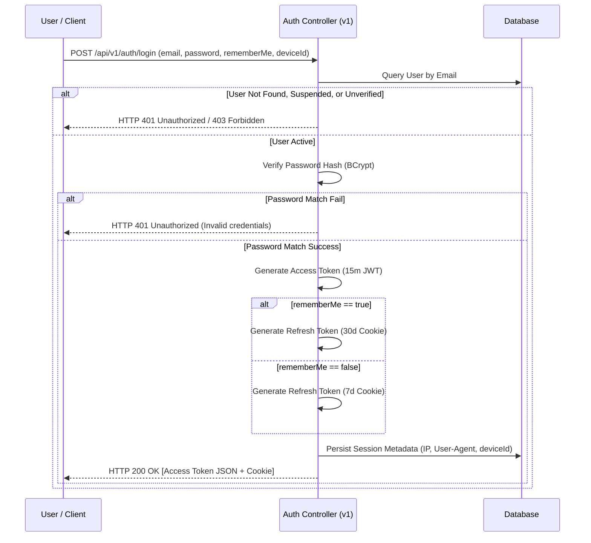
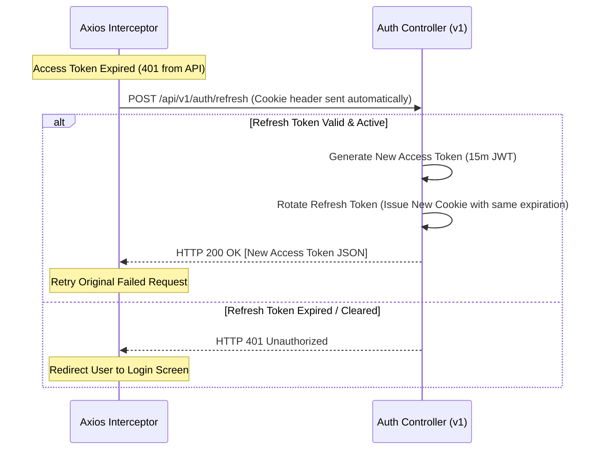
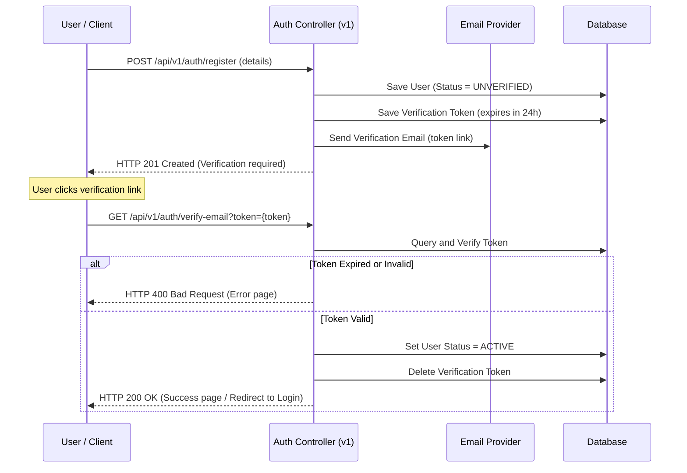

# AutoCare AI — Authentication Module Specification

This document defines the functional, security, validation, and error-handling requirements for the AutoCare AI Authentication Module. This specification governs both the Spring Boot 3 backend implementation and the React Admin / React Native client interactions.

---

## 1. Functional Requirements

*   **User Registration**:
    *   Allow users to register with an email, password, full name, and phone number.
    *   By default, newly registered users are assigned the `ROLE_USER` role.
    *   **Email Verification Workflow**: Trigger a verification email containing a short-lived link upon registration. Block user login until the email has been verified.
*   **User Authentication (Login)**:
    *   Authenticate users via email and password credentials.
    *   Return a short-lived Access Token (JWT) in the response payload.
    *   Return a long-lived Refresh Token in a secure, HTTP-only cookie.
    *   **Remember Me Behavior**: Allow users to check a "Remember Me" option during login. If enabled, the generated Refresh Token's lifetime is extended to 30 days. If disabled, the Refresh Token's lifetime defaults to 7 days.
*   **Session Refreshing**:
    *   Provide an endpoint to exchange a valid Refresh Token for a new Access Token.
*   **User Logout**:
    *   Invalidate the Refresh Token cookie by clearing it from the client browser / mobile device storage and removing session state on the backend.
    *   **Multi-Device Logout**: Provide a route to log out from all active devices (`POST /api/v1/auth/logout-all`) by invalidating all active refresh sessions linked to the user ID.
*   **Password Reset Flow**:
    *   Request a password reset link by providing a registered email.
    *   Send a secure, tokenized reset URL via email (using an abstract email provider).
    *   Allow the user to submit a new password using the reset token.
*   **Multi-Device Session Management**:
    *   Track active refresh tokens in the database with client metadata: IP address, User-Agent, and last-accessed timestamp.
    *   Allow users to retrieve their active sessions list (`GET /api/v1/auth/sessions`) and selectively revoke specific sessions (`DELETE /api/v1/auth/sessions/{sessionId}`).

---

## 2. Business Rules

*   **Uniqueness**: Email addresses must be unique across all accounts in the system.
*   **Account States**:
    *   **ACTIVE**: Default status upon registration (once verified). Can authenticate.
    *   **SUSPENDED**: Account blocked by administrators. Deny authentication attempts immediately.
    *   **UNVERIFIED**: Account registered but email verification is pending. Authentication blocked.
*   **Access Token Expiration**: Access tokens expire after 15 minutes.
*   **Refresh Token Lifespan**:
    *   Standard session (Remember Me disabled): Refresh Token is valid for 7 days.
    *   Remember Me session (Remember Me enabled): Refresh Token is valid for 30 days.
*   **Roles (ROLE_USER, ROLE_ADMIN)**:
    *   `ROLE_USER`: Standard customer/driver account. Access to their own vehicles, expenses, and settings.
    *   `ROLE_ADMIN`: Platform administrator. Full access to dashboards, user management, audit logs, and global settings.
*   **Permission Model (Future-Ready)**:
    *   To prevent role checks from hardcoding logic in code, map permissions (privileges) to roles in the database.
    *   Permissions are formatted as `[domain]:[action]` (e.g. `vehicles:read`, `vehicles:write`, `expenses:approve`, `users:manage`).
    *   Load permissions dynamically during authentication and inject them into the Access Token's security context claims.
*   **Email Verification Token Lifespan**:
    *   Email verification tokens expire 24 hours after registration. If expired, allow requesting a new link (`POST /api/v1/auth/resend-verification`).

---

## 3. Security Rules

*   **Hashing**: Hash passwords using the **BCrypt** algorithm with a strength factor of 10.
*   **Token Storage**:
    *   **Access Token**: Must *never* be stored in `localStorage` or `sessionStorage`. It must be stored in memory on the client.
    *   **Refresh Token**: Must be sent to the browser via an HTTP-only, secure, `SameSite=Strict` cookie to prevent Cross-Site Scripting (XSS) and Cross-Site Request Forgery (CSRF).
*   **CSRF Protection**: Enable CSRF defenses in Spring Security for stateful, cookie-based endpoints.
*   **Brute Force Protection**: Lock accounts for 15 minutes after 5 consecutive failed login attempts within a 10-minute window.
*   **Transport Security**: Reject non-HTTPS traffic on production environments.
*   **Rate Limiting**:
    *   Auth endpoints (`/login`, `/register`, `/forgot-password`, `/resend-verification`) must be rate-limited by IP address: max 5 requests per minute per IP.
    *   Verification submission (`/verify-email`) must be limited to max 10 requests per minute per IP to prevent token-guessing attacks.
*   **Refresh Token Rotation (RTR)**:
    *   Whenever a refresh token is used to obtain a new access token, invalidate the used refresh token and issue a new refresh token to the client. This mitigates token theft risks.

---

## 4. User Flows

### A. Login Flow


### B. In-Flight Token Refresh Flow (Silent Refresh)


### C. Email Verification Flow


---

## 5. Validation Rules

*   **Email**:
    *   Must not be blank.
    *   Must conform to RFC 5322 email syntax (validated via Zod on frontend, `@Email` on backend).
*   **Password**:
    *   Must not be blank.
    *   Minimum length: 8 characters.
    *   Complexity: Must contain at least one uppercase letter, one lowercase letter, one numeric digit, and one special character (e.g. `@`, `$`, `!`, `%`, `*`, `?`, `&`).
*   **FullName**:
    *   Must not be blank.
    *   Length limit: 2 to 100 characters.
*   **Phone Number** (Optional):
    *   Must match standard international telephone formats (regex validation).
*   **Verification Tokens**:
    *   Verification tokens and Password reset tokens must be generated using cryptographically secure random values (e.g. `SecureRandom` Base64 strings) with a minimum length of 32 characters.

---

## 6. Error Cases & HTTP Responses

| Input Condition | Target Endpoint | HTTP Status | Response payload |
| :--- | :--- | :--- | :--- |
| Missing request payload parameters | `/api/v1/auth/register` | `400 Bad Request` | Validation summary mapping fields to constraint violations. |
| Email already registered | `/api/v1/auth/register` | `409 Conflict` | `{"error": "Conflict", "message": "Email is already registered."}` |
| Invalid credentials (bad password) | `/api/v1/auth/login` | `401 Unauthorized`| `{"error": "Unauthorized", "message": "Invalid email or password."}` |
| Unverified email logins | `/api/v1/auth/login` | `403 Forbidden` | `{"error": "Forbidden", "message": "Please verify your email address before logging in."}` |
| Suspended account logins | `/api/v1/auth/login` | `403 Forbidden` | `{"error": "Forbidden", "message": "Account has been suspended."}` |
| Expired reset token usage | `/api/v1/auth/reset` | `400 Bad Request` | `{"error": "Bad Request", "message": "Reset token has expired or is invalid."}` |
| Rate limit exceeded | (All auth endpoints) | `429 Too Many Requests`| `{"error": "Too Many Requests", "message": "Too many requests. Please try again in 1 minute."}` |

---

## 7. Acceptance Criteria

### A. Backend Execution
*   `POST /api/v1/auth/register` creates a user record in the database with status `UNVERIFIED` and sends a verification email.
*   `GET /api/v1/auth/verify-email` transitions status from `UNVERIFIED` to `ACTIVE`.
*   `POST /api/v1/auth/login` verifies credentials, checks for email verification status, sets the `Set-Cookie` header for the Refresh Token (with 7-day or 30-day max-age based on `rememberMe` request flag), and returns the JWT access token.
*   `POST /api/v1/auth/refresh` correctly rotates the Refresh Token and returns a new Access Token.
*   `POST /api/v1/auth/logout-all` invalidates all stored sessions of the authenticated user.
*   Spring Security configurations block unauthenticated endpoints while permitting public authentication paths.

### B. Frontend / Client Execution
*   Login forms show descriptive inline messages when validation rules fail.
*   Client handles silent tokens refresh using an Axios request interceptor without interrupting the user.
*   A user logging out has their local in-memory token destroyed and is redirected to the login view.

---

## 8. Audit Logging Specifications

*   **Logged Events**:
    *   `USER_REGISTERED` (User ID, IP, Timestamp)
    *   `EMAIL_VERIFIED` (User ID, IP, Timestamp)
    *   `LOGIN_SUCCESS` (User ID, IP, Session ID, Timestamp)
    *   `LOGIN_FAILURE` (Attempted Email, IP, Reason, Timestamp)
    *   `PASSWORD_RESET_REQUESTED` (Email, IP, Timestamp)
    *   `PASSWORD_RESET_COMPLETED` (User ID, IP, Timestamp)
    *   `SESSION_REVOKED` (User ID, Session ID, IP, Timestamp)
*   **Storage Strategy**: Log entries must be written to an asynchronous, append-only database table (`audit_logs`) to prevent request threads from blocking. They must never be modifiable or deletable by standard application users.

---

## 9. Email Provider Abstraction

To decouple email delivery from specific SMTP services, declare an interface on the backend:

```java
public interface EmailService {
    void sendVerificationEmail(String recipientEmail, String token);
    void sendPasswordResetEmail(String recipientEmail, String token);
}
```

*   **Fallback Implementation**: A console-logger implementation for local and development environments (`DevEmailService`).
*   **Production Implementation**: A transactional email adapter utilizing external mail APIs (e.g. Resend, SendGrid, or AWS SES).

---

## 10. JWT Claims & Token Schema Specification

Every generated Access Token (JWT) must follow this structural layout:

### A. JWT Header
```json
{
  "alg": "HS256",
  "typ": "JWT"
}
```

### B. JWT Payload Claims
```json
{
  "sub": "user@example.com",
  "userId": "uuid-v4-string",
  "sessionId": "uuid-v4-string",
  "deviceId": "client-defined-uuid-or-hash-string",
  "roles": ["ROLE_USER"],
  "permissions": ["vehicles:read", "expenses:write"],
  "name": "Jane Doe",
  "iat": 1719875600,
  "exp": 1719876500
}
```

*   `sub` (Subject): The user's authenticated email.
*   `userId`: The unique database UUID identifying the user record.
*   `sessionId`: The current active session ID linked to the persisted refresh session.
*   `deviceId`: Unique client hardware device signature or identifier.
*   `roles`: Standard Spring Security role authorizations.
*   `permissions`: String array containing fine-grained privileges to support future-ready ACL validation.
*   `iat` (Issued At): Unix timestamp of generation.
*   `exp` (Expiration): Unix timestamp of expiry (Exactly 15 minutes after `iat`).
*   **Signature Security**: Sign JWTs with a HMAC SHA-256 key with a minimum security strength of 256 bits, loaded via environment variables (`JWT_SECRET`).

---

## 11. AI Authorization Rules

*   **Authentication Constraint**: All AI assistant endpoints (`/api/v1/ai/**`) require a valid JWT Access Token. Guest or anonymous interactions are strictly blocked.
*   **Conversation Ownership**: AI chat history and associated messages are owned entirely by the authenticated user who initiated the chat session.
*   **Access Isolation**: Users must never be allowed to query or access another user's AI conversations. The backend must validate the token's `userId` claim against the database conversation's owner ID for every query, returning `403 Forbidden` on matches mismatch.
*   **Future-Ready Quotas/Credits**:
    *   Users will have numeric limits on query usage (e.g., `aiCredits`).
    *   The backend database design must include a `credits` field on the User entity.
    *   If a user has 0 credits, all requests to AI conversation endpoints must fail with `403 Forbidden` and a clear response message: "AI query quota exceeded. Please upgrade your plan."
